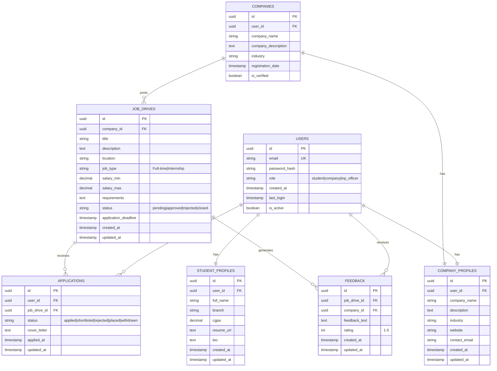

# 🎓 CampusHire - Campus Placement Portal

A modern, full-stack web application designed to streamline the campus placement process. CampusHire connects students, companies, and placement officers in a unified platform for efficient job drive management and placement tracking.

**Live Demo:** [GitHub Repository](https://github.com/Prathamesh-2005/Campus-Placement-Portal)

---

## ✨ Features

### 👨‍🎓 Student Dashboard

- 📋 Browse available job drives
- 💼 Apply to job postings
- 📊 Track application status (Applied, Shortlisted, Rejected, Placed)
- 👤 View and manage personal profile
- 📧 Receive notifications for updates
- 📈 Track placement statistics

### 🏢 Company Dashboard

- ➕ Create and manage job drives
- 📝 Post job descriptions and requirements
- 👥 Review student applications
- ✅ Update application statuses
- 📊 View applicant statistics
- 🔔 Manage job drive visibility

### 👨‍💼 TNP Officer Dashboard

- ⚖️ Approve/reject company job drives
- 👥 Monitor all registered companies
- 📊 View placement statistics
- 👤 Search and verify company profiles
- 📧 Process and verify student details
- 🎯 Track placement metrics

---

## 🏗️ Tech Stack

### Frontend

- **React 19.2.4** - UI library with latest hooks and features
- **Vite 8.0.1** - Lightning-fast build tool with HMR
- **React Router DOM 6.30.3** - Client-side routing
- **Tailwind CSS 4.2.2** - Modern utility-first CSS framework
- **Lucide React** - Beautiful, consistent icon library
- **Radix UI** - Unstyled, accessible component primitives

### Backend & Database

- **Supabase** - Open-source Firebase alternative
  - PostgreSQL database
  - Authentication & authorization
  - Real-time subscriptions
  - Row-level security (RLS)

### State Management & Notifications

- **React Context API** - Global state management
- **react-hot-toast** - User-friendly notifications

---

## 📂 Project Structure

```
src/
├── components/          # Reusable React components
│   ├── GithubContributionGraph.jsx
│   └── ProtectedRoute.jsx
├── context/
│   └── AuthContext.jsx  # Authentication state management
├── pages/               # Page components for routing
│   ├── LoginPage.jsx
│   ├── RegisterPage.jsx
│   ├── StudentDashboard.jsx
│   ├── CompanyDashboard.jsx
│   ├── TNPDashboard.jsx
│   ├── PublicProfile.jsx
│   └── LandingPage.jsx
├── lib/
│   ├── supabase.js      # Supabase client setup
│   └── safeAuth.js      # Authentication utilities
├── assets/              # Images, icons, etc.
├── App.jsx              # Main app component
├── App.css              # Global styles
├── main.jsx             # Entry point
└── index.css            # Base Tailwind styles
```

---

## � Screenshots

### Landing Page


_Modern landing page showcasing platform features and value proposition_

### Student Dashboard


_Browse available job drives and track applications_

### Company Dashboard


_Manage job drives and review student applications_

### TNP Officer Dashboard


_Approve job drives and monitor placement statistics_

### Authentication Pages


_Modern login and registration interfaces_


_Modern Signup  and registration interfaces_

---



---

## 🚀 Getting Started

### Prerequisites

- Node.js 18+ and npm/yarn
- Supabase account (free tier available at [supabase.com](https://supabase.com))

### Installation

1. **Clone the repository**

   ```bash
   git clone https://github.com/Prathamesh-2005/Campus-Placement-Portal.git
   cd Campus-Placement-Portal
   ```

2. **Install dependencies**

   ```bash
   npm install
   ```

3. **Set up environment variables**
   Create a `.env` file in the root directory:

   ```bash
   VITE_SUPABASE_URL=your_supabase_url
   VITE_SUPABASE_ANON_KEY=your_supabase_anon_key
   ```

4. **Set up Supabase database**
   - Create a new Supabase project
   - Run the SQL migrations (see `SETUP.md` for detailed instructions)
   - Enable Row-Level Security (RLS) on tables

5. **Start the development server**
   ```bash
   npm run dev
   ```
   The app will be available at `http://localhost:5173`

---

## 🔐 Authentication Roles

### Student

- Register with name, branch, and CGPA
- Browse and apply to job drives
- Track application status in real-time
- View company profiles

### Company

- Register with company details
- Post job drives after TNP approval
- Manage applications and applicants
- Update candidate statuses

### TNP Officer (Admin)

- Approve/reject company job drives
- Verify company and student profiles
- Monitor placement statistics
- Access all dashboard data

---

## 📦 Build & Deployment

### Build for production

```bash
npm run build
```

Output will be in the `dist/` folder.

### Preview production build locally

```bash
npm run preview
```

### Lint code

```bash
npm run lint
```

---

## 🎨 Design System

- **Color Scheme:**
  - Primary: Blue-600 → Blue-700 (gradients)
  - Dark: Slate-900 → Slate-800 (headers)
  - Light: Slate-50 → Blue-50 (backgrounds)
  - Success: Emerald (✅)
  - Warning: Amber (⚠️)
  - Error: Rose (❌)

- **Components:**
  - Glass-morphism cards (white/95 with backdrop blur)
  - Gradient headers and buttons
  - Rounded corners (rounded-2xl)
  - Shadow effects for depth
  - Responsive grid layouts

---

## 📝 API Documentation

For detailed API endpoints and Supabase setup, see [SETUP.md](./SETUP.md)

---

## 🤝 Contributing

Contributions are welcome! Please follow these steps:

1. Fork the repository
2. Create a feature branch (`git checkout -b feature/amazing-feature`)
3. Commit changes (`git commit -m 'Add amazing feature'`)
4. Push to branch (`git push origin feature/amazing-feature`)
5. Open a Pull Request

---

## 📄 License

This project is licensed under the MIT License - see the LICENSE file for details.

---

## 👥 Contact & Support

- **Project Lead:** Prathamesh-2005
- **Issues & Feedback:** [GitHub Issues](https://github.com/Prathamesh-2005/Campus-Placement-Portal/issues)
- **Email:** Contact via GitHub

---

**Happy Coding! 🎉**
